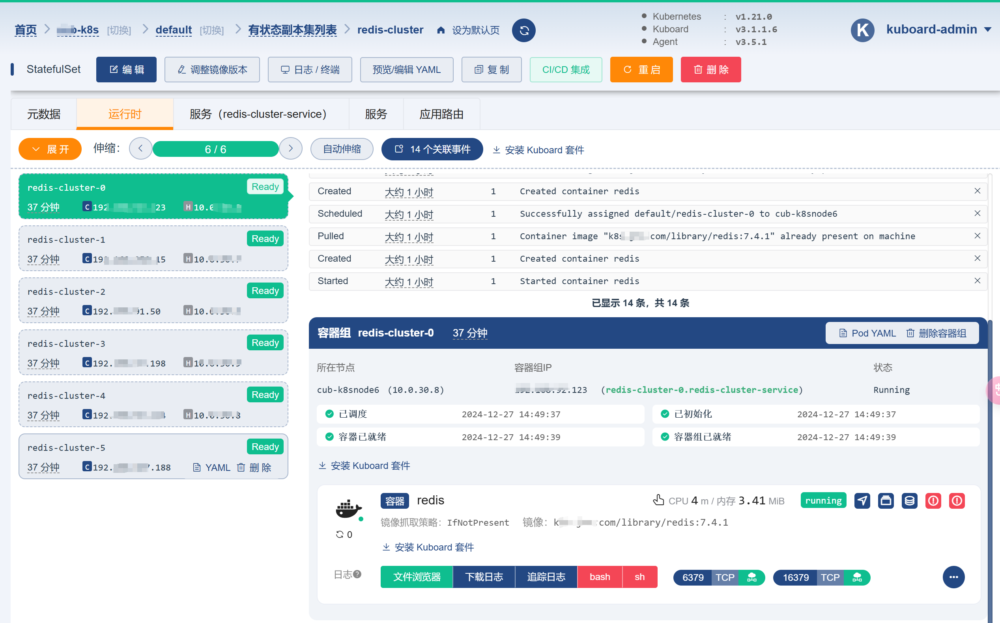

# Redis Cluster on Kubernetes

基于 Kubernetes 部署高可用 Redis 集群的配置和脚本。
.
├── README.md # 项目说明文档
├── redis-configmap.yaml # Redis配置文件
├── redis-service.yaml # Redis Service定义
├── redis-statefulset.yaml # Redis StatefulSet定义
└── create-redis-cluster.sh # 集群创建脚本

## 集群样例图

Redis集群采用3主3从的高可用架构:
- 6个Redis节点,其中3个主节点,3个从节点
- 每个主节点对应一个从节点进行数据备份
- 所有节点通过Kubernetes StatefulSet方式部署
- 使用Kubernetes Service进行服务发现
- 基于hostPath实现数据持久化存储
- 节点间通过16379端口进行集群总线通信
- 客户端通过6379端口访问集群服务

## 环境要求

- Kubernetes 1.16+
- 所有K8s节点已创建目录：/data/file/nfs/redis
- 目录具有适当的读写权限
- Redis镜像：k8s.*.com/library/redis:7.4.1

## 配置说明

### redis-configmap.yaml
- Redis基础配置
- 启用集群模式
- 配置文件存储路径
- 超时设置等

### redis-service.yaml
- Headless Service
- 暴露6379(客户端通信)和16379(集群总线)端口

### redis-statefulset.yaml
- 部署6个Redis节点
- 使用hostPath持久化存储
- 为每个Pod配置独立的数据目录

## 部署步骤

1. 在所有K8s节点创建数据目录：
bash
mkdir -p /data/file/nfs/redis
chmod 777 /data/file/nfs/redis

2. 执行部署脚本：
bash
chmod +x create-redis-cluster.sh
./create-redis-cluster.sh

## 脚本说明
create-redis-cluster.sh 会自动执行以下操作：
1. 应用ConfigMap和Service配置
2. 删除已存在的StatefulSet（如果有）
3. 创建新的StatefulSet
4. 等待所有Pod就绪
5. 初始化Redis集群

## 集群验证
部署完成后，可以通过以下命令验证集群状态：
bash
查看集群节点状态
kubectl exec -it redis-cluster-0 -- redis-cli cluster nodes
查看集群信息
kubectl exec -it redis-cluster-0 -- redis-cli cluster info

## 数据目录结构
/data/file/nfs/redis/
├── redis-cluster-0/
├── redis-cluster-1/
├── redis-cluster-2/
├── redis-cluster-3/
├── redis-cluster-4/
└── redis-cluster-5/

每个Redis节点的数据和配置文件都存储在各自的子目录中。

## 注意事项

1. 确保有足够的磁盘空间
2. 所有节点都需要有数据目录的读写权限
3. 集群创建后，建议验证主从复制状态
4. 生产环境建议配置资源限制和健康检查

## 维护操作

### 扩容/缩容
修改redis-statefulset.yaml中的replicas数量，然后重新应用配置：
bash
kubectl apply -f redis-statefulset.yaml

### 配置更新
1. 修改redis-configmap.yaml
2. 应用新配置：
bash
kubectl apply -f redis-configmap.yaml
3. 重启StatefulSet：
bash
kubectl rollout restart statefulset redis-cluster

### 清理集群
bash
kubectl delete -f redis-statefulset.yaml
kubectl delete -f redis-service.yaml
kubectl delete -f redis-configmap.yaml
 
 
